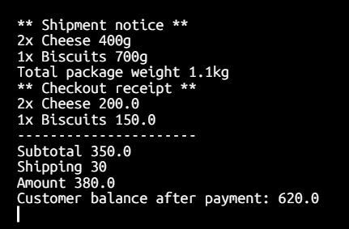

# E-commerce Challenge

## What The Challenge Needs

- Define products with name, price, and quantity.
- Some products can expire like Cheese or Biscuits.
- Some products need shipping like Cheese and TV. Shipping items have weight.
- Some products don’t need shipping like scratch cards.
- Customer can add products to cart, but not more than available quantity.
- Customer can checkout and see:
  - Order subtotal
  - Shipping fees
  - Total amount (subtotal + shipping)
  - Customer balance after payment
- Must check:
  - If cart is empty
  - If customer balance is not enough
  - If product is out of stock or expired
- ShippingService takes all products that need shipping and uses:
  - `getName()`
  - `getWeight()`

## My Solution

- I used Java.
- I wrote some classes:
  - `Product` → has product info like name, price, quantity, etc.
  - `User` → has customer balance.
  - `Cart` → has items and quantities.
- I have a file called `Main.java` that has the `main` method.
- Other classes are in other files in the same package.
- In `Main.java` I:
  - create products
  - create customer
  - add products to cart
  - call checkout to print receipt
  
## Example Output 


## How To Run
- Go to the folder in terminal.
- Compile and run like this:

```bash
javac com/ecom/*.java
java com.ecom.Main
```

